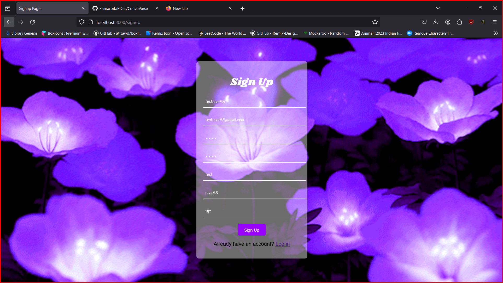
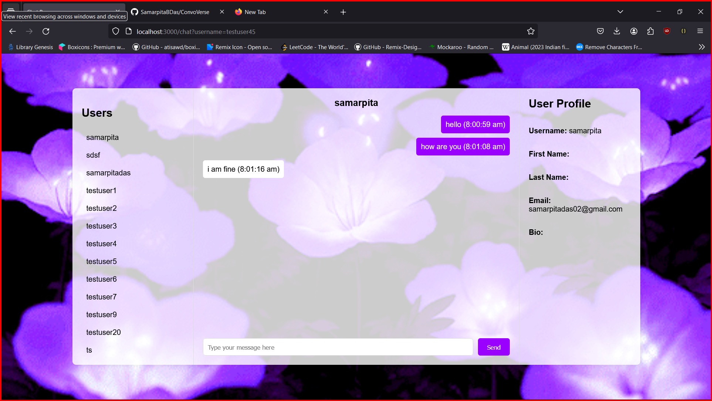

# ConvoVerse

Welcome to **ConvoVerse** – your premier platform for engaging, dynamic conversations! ConvoVerse is designed to foster meaningful interactions and connections through a seamless and intuitive chat experience.

## Table of Contents

- [Features](#features)
- [Getting Started](#getting-started)
- [Installation](#installation)
- [Screenshots](#Screenshots)
- [Usage](#usage)
- [License](#license)


## Features

- **Real-time Chat:** Enjoy smooth, real-time conversations with friends, family, and colleagues.
- **User-Friendly Interface:** Navigate through a clean and intuitive interface designed for ease of use.
- **Customizable Profiles:** Personalize your profile with avatars, statuses, and more.
- **Secure Messaging:** All messages are encrypted to ensure your conversations remain private.
- **Group Chats:** Create and join group chats to connect with multiple people at once.
- **Multimedia Support:** Share images, videos, and files seamlessly within your conversations.
- **Notifications:** Stay updated with real-time notifications for new messages and activities.

## Getting Started

To get started with ConvoVerse, follow these simple steps:

1. **Sign Up:** Create a new account using your email address or social media login.
2. **Set Up Your Profile:** Customize your profile with a picture and status.
3. **Start Chatting:** Begin new conversations or join existing ones.

## Installation

To run ConvoVerse locally, follow these instructions:

1. Clone the repository:
    ```bash
    git clone https://github.com/samarpitabdas/ConvoVerse.git
    ```
2. Navigate to the project directory:
    ```bash
    cd ConvoVerse
    ```
3. Install the dependencies:
    ```bash
    npm install
    ```
4. Start the development server:
    ```bash
    npm start
    ```
## Screenshots



## Usage

Once the development server is running, you can access ConvoVerse in your web browser at `http://localhost:3000`. From there, you can log in, set up your profile, and start engaging in conversations.

## License

This project is licensed under the MIT License. See the [LICENSE](LICENSE) file for details.

